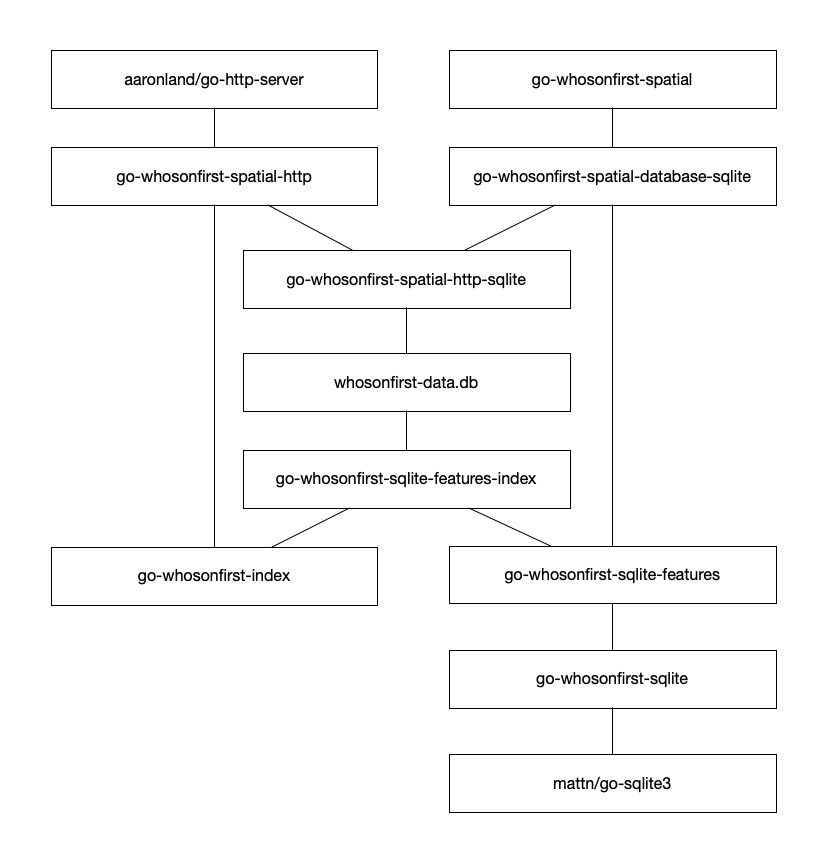

# go-whosonfirst-spatial

## IMPORTANT

It is work in progress. It works... until it doesn't. It is not well documented yet.

_Once complete this package will supersede the [go-whosonfirst-pip-v2](https://github.com/whosonfirst/go-whosonfirst-pip-v2) package._

## Motivation

The following is adapted from [an answer about the differences](https://github.com/whosonfirst/go-whosonfirst-pip-v2/issues/34) between this package and the [go-whosonfirst-pip-v2](https://github.com/whosonfirst/go-whosonfirst-pip-v2) package from which it is derived:

---

It is an attempt to de-couple the various components that make up `go-whosonfirst-pip-v2` – indexing, storage, querying and serving – in to separate packages in order to allow for more flexibility.

_Keep in mind that all of the examples that follow are a) actively being worked b) don't work properly in many cases c) poorly documented still._

For example there is a single "base" package that defines database-agnostic but WOF-specific interfaces for spatial queries and reading properties:

* https://github.com/whosonfirst/go-whosonfirst-spatial

Which are then implemented in full or in part by provider-specific classes. For example, SQLite:

* https://github.com/whosonfirst/go-whosonfirst-spatial-sqlite

This package implements both interfaces which means indexing spatial queries is much faster as are appending "extra" properties (assuming a pre-indexed database generated using the https://github.com/whosonfirst/go-whosonfirst-sqlite-features-index package).

Other packages only implement the spatial interfaces like:

* https://github.com/whosonfirst/go-whosonfirst-spatial-rtree

Or the properties reader interfaces like:

* https://github.com/whosonfirst/go-whosonfirst-spatial-reader

Building on that there are equivalent base packages for "server" implementations, like:

* https://github.com/whosonfirst/go-whosonfirst-spatial-http
* https://github.com/whosonfirst/go-whosonfirst-spatial-grpc

The idea is that all of these pieces can be _easily_ combined in to purpose-fit applications.  As a practical matter it's mostly about trying to identify and package the common pieces in to as few lines of code as possible so that they might be combined with an application-specific `import` statement. For example:

```
import (
         _ "github.com/whosonfirst/go-whosonfirst-spatial-MY-SPECIFIC-REQUIREMENTS"
)
```

Here is a concrete example, implementing a point-in-polygon service over HTTP using a SQLite backend:

* https://github.com/whosonfirst/go-whosonfirst-spatial-http-sqlite/blob/main/cmd/server/main.go

It is part of the overall goal of:

* Staying out people's database or delivery choices (or needs)
* Supporting as many databases (and delivery (and indexing) choices) as possible
* Not making database B a dependency (in the Go code) in order to use database A, as in not bundling everything in a single mono-repo that becomes bigger and has more requirements over time.

For example:



That's the goal, anyway. I am still working through the implementation details.

Functionally the `go-whosonfirst-spatial-` packages should be equivalent to `go-whosonfirst-pip-v2` as in there won't be any functionality _removed_.

## Example

```
import (
	"context"
	"encoding/json"
	"fmt"
	"github.com/whosonfirst/go-whosonfirst-spatial/app"
	"github.com/whosonfirst/go-whosonfirst-spatial/filter"
	"github.com/whosonfirst/go-whosonfirst-spatial/flags"
	"github.com/whosonfirst/go-whosonfirst-spatial/geo"		
	_ "github.com/whosonfirst/go-whosonfirst-spatial-rtree"	
)

func main() {

	fl, _ := flags.CommonFlags()
	flags.Parse(fl)

	flags.ValidateCommonFlags(fl)

	paths := fl.Args()
	
	ctx := context.Background()

	spatial_app, _ := app.NewSpatialApplicationWithFlagSet(ctx, fl)
	spatial_app.IndexPaths(ctx, paths...)

	coords, _ := geo.NewCoordinate(-122.395229, 37.794906)
	f, _ := filter.NewSPRFilter()

	spatial_db := spatial_app.SpatialDatabase
	spatial_results, _ := spatial_db.PointInPolygon(ctx, &coords, f)

	body, _ := json.Marshal(spatial_results)
	fmt.Println(string(body))
}
```

_Error handling omitted for brevity._

## Concepts

### Applications

_Please write me_

### Database

_Please write me_

### Filters

_Please write me_

### Indices

_Please write me_

### Standard Places Response (SPR)

_Please write me_

## Interfaces

### SpatialDatabase

```
type SpatialDatabase interface {
	IndexFeature(context.Context, wof_geojson.Feature) error
	PointInPolygon(context.Context, geom.Coord, filter.Filter) (spr.StandardPlacesResults, error)
	PointInPolygonCandidates(context.Context, geom.Coord) (*geojson.GeoJSONFeatureCollection, error)
	PointInPolygonWithChannels(context.Context, geom.Coord, filter.Filter, chan spr.StandardPlacesResult, chan error, chan bool)
	PointInPolygonCandidatesWithChannels(context.Context, geom.Coord, chan geojson.GeoJSONFeature, chan error, chan bool)
	StandardPlacesResultsToFeatureCollection(context.Context, spr.StandardPlacesResults) (*geojson.GeoJSONFeatureCollection, error)
	Close(context.Context) error
}
```

### PropertiesReader

```
type PropertiesReader interface {
	IndexFeature(context.Context, wof_geojson.Feature) error
	PropertiesResponseResultsWithStandardPlacesResults(context.Context, spr.StandardPlacesResults, []string) (*PropertiesResponseResults, error)
	AppendPropertiesWithFeatureCollection(context.Context, *geojson.GeoJSONFeatureCollection, []string) error
	Close(context.Context) error
}
```

## See also

* https://github.com/whosonfirst/go-whosonfirst-spatial-rtree
* https://github.com/whosonfirst/go-whosonfirst-spatial-sqlite
* https://github.com/whosonfirst/go-whosonfirst-spatial-http
* https://github.com/whosonfirst/go-whosonfirst-spatial-http-sqlite
* https://github.com/whosonfirst/go-whosonfirst-spatial-grpc